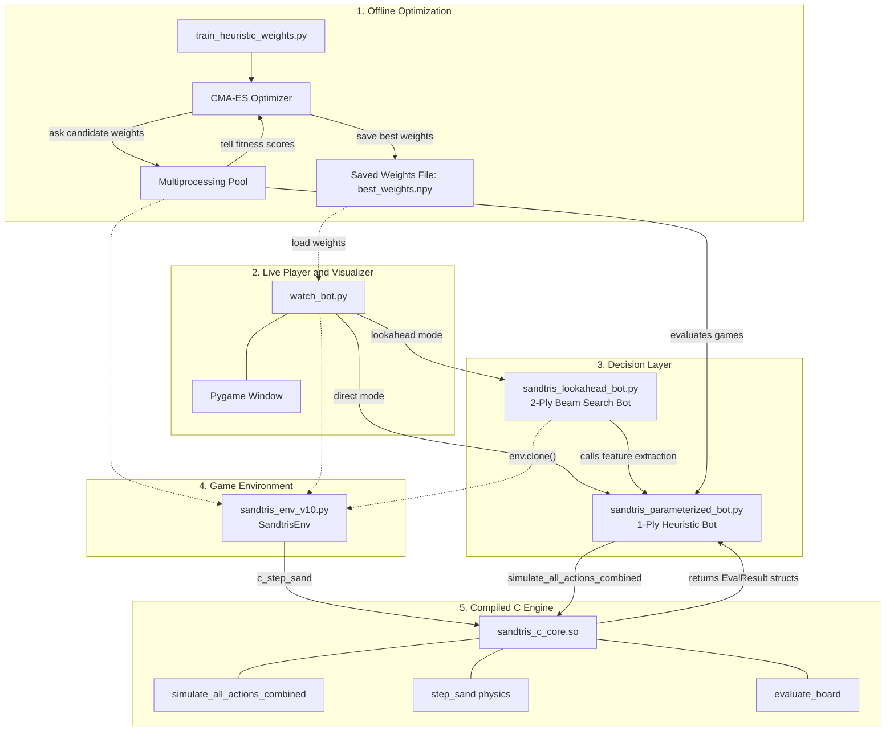
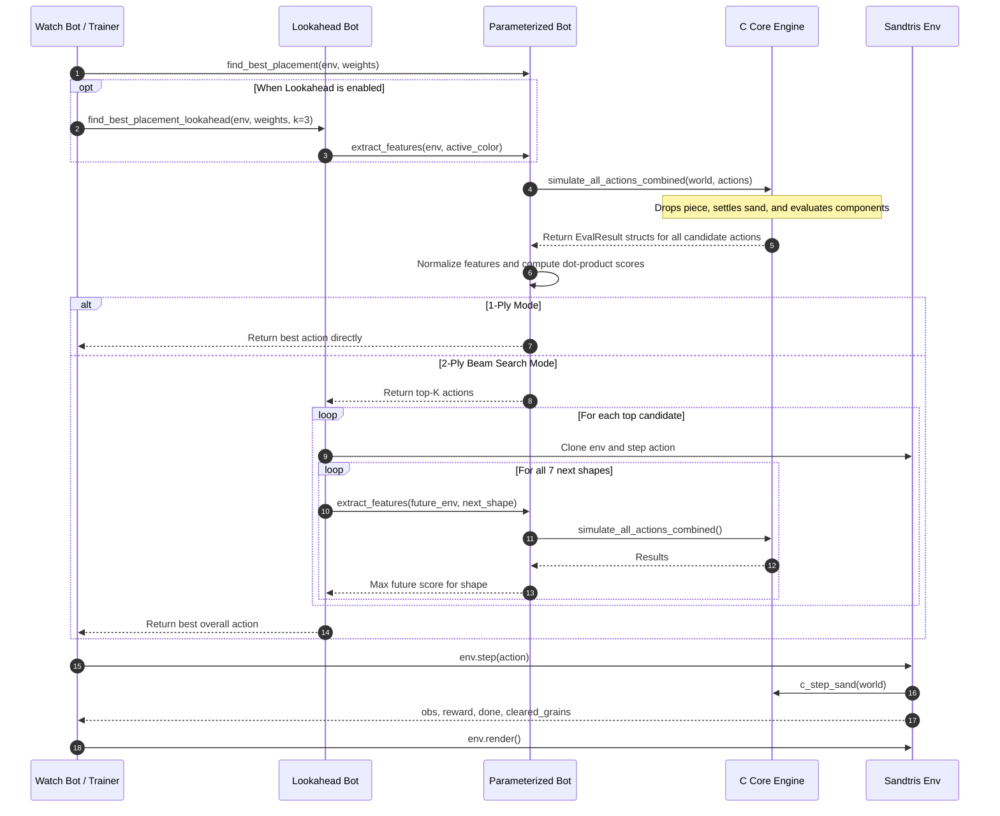

# Sandtris AI: High-Performance Heuristic Search & Evolutionary Optimization for Falling-Sand Tetris

[](#)
[](#)
[](#)
[](#)

> **An autonomous AI system capable of surviving over 15,000 consecutive steps in Sandtris (Falling-Sand Tetris). Combines a compiled C-core cellular automata physics engine, a 24-dimensional topological feature extractor with non-linear clipping gates, CMA-ES evolutionary optimization, and 2-ply Expectimax beam search lookahead.**

---

## Table of Contents
1. [Executive Overview](#1-executive-overview)
2. [The Sandtris Challenge: Sand vs. Discrete Tetris](#2-the-sandtris-challenge-sand-vs-discrete-tetris)
3. [System Architecture](#3-system-architecture)
4. [File-by-File Technical Deep Dive](#4-file-by-file-technical-deep-dive)
   - [sandtris_c_core.c (Native Physics & Evaluation Engine)](#1-sandtris_c_corec--so-native-c-engine)
   - [sandtris_env_v10.py (Gymnasium Environment)](#2-sandtris_env_v10py-gymnasium-game-environment)
   - [sandtris_parameterized_bot.py (1-Ply Feature Extractor & Bot)](#3-sandtris_parameterized_botpy-1-ply-decision-engine)
   - [sandtris_lookahead_bot.py (2-Ply Beam Search Lookahead)](#4-sandtris_lookahead_botpy-2-ply-beam-search-engine)
   - [train_heuristic_weights.py (CMA-ES Evolutionary Trainer)](#5-train_heuristic_weightspy-evolutionary-optimization)
   - [watch_bot.py (Interactive Visualizer)](#6-watch_botpy-live-interactive-visualizer)
5. [The Feature Engineering Breakthrough: "Accidental Logic Gates"](#5-the-feature-engineering-breakthrough-accidental-logic-gates)
6. [Benchmark Performance & Results](#6-benchmark-performance--results)
7. [Installation & Quickstart Guide](#7-installation--quickstart-guide)
8. [Repository Map](#8-repository-map)

---

## 1. Executive Overview

**Sandtris** transforms the rigid, discrete mechanics of classical 1984 Tetris into a continuous fluid dynamics challenge. When a falling tetromino touches settled terrain, its structural bonds shatter instantly into 100 individual grains of sand that collapse under gravity and slide diagonally at an angle of repose.

Early attempts using standard Deep Reinforcement Learning (PPO and DQN with CNNs) failed due to extreme spatial instability, fluid non-rigidity, and sparse reward landscapes. To overcome this, this project implements:

1. **A Compiled C-Core Engine (`sandtris_c_core.so`)**: Accelerates cellular automata physics and connected-component graph analysis by **100x**, executing all 68 candidate moves per turn in under 15ms.
2. **A 24-Dimensional Topological Feature Space**: Evaluates global board geometry, active piece growth frontiers, and background color preservation.
3. **The "Accidental Logic Gate" Clipping Mechanism**: Narrow feature bounds that implicitly turn linear dot-products into non-linear decision-tree logic gates.
4. **CMA-ES (Covariance Matrix Adaptation Evolution Strategy)**: Optimizes feature weights across multi-core parallel processes, breaking past the 1,000-step training limit.
5. **2-Ply Expectimax Beam Search Lookahead**: Evaluates the expected future board survivability across all 7 next tetromino shapes.

---

## 2. The Sandtris Challenge: Sand vs. Discrete Tetris

```
Classical Tetris (Discrete, Rigid)              Sandtris (Continuous, Granular Fluid)
┌─────────────────────────────────┐             ┌─────────────────────────────────────┐
│  [ ] [ ] [ ] [ ] [ ] [ ] [ ]    │             │         . : : .   (Sand Peak)       │
│  [X] [X] [X] [X] [X] [X] [X]    │ <- 1 Clear  │       . : : : : .                   │
│  [X] [ ] [X] [X] [ ] [X] [X]    │             │   . : : ~Red Path~ : : . <- Clear!  │
└─────────────────────────────────┘             │  : : : : : : : : : : : : :          │
                                                └─────────────────────────────────────┘
```

| Dimension | Classical Tetris | Sandtris |
| :--- | :--- | :--- |
| **Grid Size** | $10 \times 20$ (200 discrete cells) | **$85 \times 150$ (12,750 sand grains)** |
| **Piece Behavior** | Rigid geometric matrix forever | Shatters into 100 grains upon impact |
| **Physics** | Discrete row translation | **2-pass cellular automaton** (gravity + $45^\circ$ lateral slide) |
| **Clear Condition** | Flat horizontal line of 10 blocks | **Continuous monochromatic path connecting left wall to right wall** |
| **State Space** | Small, discrete binary matrix | Continuous fluid arrangements ($4^{12,750}$ combinations) |
| **Post-Clear Event** | Discrete downward row shift | Dynamic gravitational avalanche into the newly opened vacuum |

---

## 3. System Architecture

### Offline Training vs. Online Inference Flow



### Turn Execution & Lookahead Sequence



---

## 4. File-by-File Technical Deep Dive

### 1. `sandtris_c_core.c` / `.so` (Native C Engine)
The C core executes all compute-heavy operations. The entire $150 \times 85$ board requires only 12.75 KB of RAM, fitting inside the CPU's **L1 data cache**.

* **Cellular Automata Kernel (`step_sand`)**:
  * **Pass 1 (Vertical Gravity)**: Scans from bottom up (`y = 148` down to `0`). Sand falls straight down if `world[y+1][x] == 0`.
  * **Pass 2 (Diagonal Sliding)**: If directly blocked, grains slide diagonally down-left or down-right. An alternating parity mask `((x + y + iter) % 2 == 0)` alternates direction to eliminate artificial left/right pooling bias.
  * Runs for up to 200 iterations with early termination when steady state is reached (`changed == false`).
* **Classical Board Evaluator (`evaluate_board`)**:
  * Column height profiling, maximum height, and column-to-column bumpiness: $\sum |h_x - h_{x+1}|$.
  * Surface exposure mask: identifies sand grains touching empty air.
  * Stack-based non-recursive flood fill (zero `malloc` calls in game loops). Tracks single-color connected components. If any single cluster touches both $x=0$ and $x=84$, it registers a line clear.
* **Frontier Evaluator (`evaluate_frontier_board`)**:
  * Air flood-fill starting from the sky row ($y=0$) into `air_mask`. This differentiates **open surface sand** from **sealed underground caves**.
  * Directional useful frontier: counts exposed grains that face their target wall.
  * Momentum flow metric: $\text{useful\_frontier} \times \left(\frac{\text{span}}{85}\right)^2 \times \left(\frac{\text{comp\_size}}{1000}\right)$.
* **Master Batch Simulator (`simulate_all_actions_combined`)**:
  * Receives all 68 action configurations from Python in flat arrays.
  * Simulates the drop, sand settlement, and both evaluation functions on scratchpad memory.
  * Validates legality and detects top-out game overs ($y=0$). Populates both `EvalResult` and `EvalFrontierResult` C structs.

### 2. `sandtris_env_v10.py` (Gymnasium Game Environment)
Maintains the canonical game state and exposes a standard Gymnasium reinforcement learning interface:
* **Board & Pieces**: Grid dimensions $150 \times 85$, 4 distinct colors, 7 classic tetromino shapes ($5 \times 5$ grains per block = 100 grains per piece).
* **Action Decoding**: Decodes a single integer action into rotation index ($0-3$) and target column block index ($0-16$):
  ```python
  rot_idx = action // num_block_cols
  block_col = action % num_block_cols
  ```
* **Step Execution (`step`)**: Drops the active piece, invokes `_c_core.c_step_sand` to compute physical settlement, detects wall-to-wall component line clears, and spawns the next piece.
* **State Isolation (`clone`)**: Deep-copies the environment state to enable lookahead branching without polluting the live game.
* **Observation Tensor (`_get_obs`)**: Constructs a 3-channel normalized tensor `(3, 150, 85)`:
  * Channel 0: Settled world sand.
  * Channel 1: Active falling piece.
  * Channel 2: Binary occupancy mask.

### 3. `sandtris_parameterized_bot.py` (1-Ply Decision Engine)
Converts raw simulation data into a decision score:
* Binds Python to `sandtris_c_core.so` via `ctypes`.
* Coordinates action batching: generates candidate geometries for all 68 possible actions and sends them to the C core in a single call.
* Assembles the 24-dimensional feature vector $\mathbf{\phi}(a)$.
* Normalizes features using `CLIPPED_BOUNDS` (or `TRUE_BOUNDS`).
* Evaluates action quality via dot product: $\text{Score}(a) = \mathbf{\phi}(a) \cdot \mathbf{w}$.
* Returns $\text{Best Action} = \arg\max_a \text{Score}(a)$.

### 4. `sandtris_lookahead_bot.py` (2-Ply Beam Search Engine)
Implements depth-2 Expectimax search to prevent short-sighted tactical moves:
* **Stage 1 (1-Ply Candidate Pruning)**: Uses `sandtris_parameterized_bot` to score all 68 actions, selecting the top-$K$ best candidates ($K=3$).
* **Stage 2 (Future Branching)**: For each candidate move:
  1. Clones the environment (`env.clone()`) and applies the candidate action.
  2. If the move results in immediate death (`done == True`), it receives a $-\infty$ penalty.
  3. Projects the next turn across all 7 standard tetromino shapes (`SHAPES`).
  4. Computes the maximum possible score achievable for each prospective shape using the learned weights.
  5. Computes the expected future value: $\mathbb{E}[\text{Future Score}] = \frac{1}{7} \sum_{s=1}^7 \max_{a'} \text{Score}(a' \mid s)$.
* **Decision Criterion**:
  $$\text{Action}^* = \arg\max_{a \in \text{Top-}K} \left( \text{BaseScore}(a) + 0.85 \times \mathbb{E}[\text{FutureScore} \mid a] \right)$$

### 5. `train_heuristic_weights.py` (Evolutionary Optimization)
Trains the parameter weights $\mathbf{w}$ using Covariance Matrix Adaptation Evolution Strategy (CMA-ES):
* **Parallel Population Evaluation**: Employs Python `multiprocessing.Pool` (using the `'spawn'` method for safe C-library sharing) to evaluate 20 candidate weight vectors across all CPU cores simultaneously.
* **Fitness Formulation**:
  $$\text{Fitness} = \text{Steps Survived} + \text{Total Grains Cleared}$$
* **Controlled Evaluation**: Evaluates each candidate across identical pseudo-random seeds (`gen_seeds`) per generation to guarantee fair comparison.
* **Fine-Tuning Mode**: Supports resuming from previous checkpoints with reduced mutation scale ($\sigma \leftarrow \sigma \times 0.33$) for local parameter refinement.

### 6. `watch_bot.py` (Live Interactive Visualizer)
Interactive frontend for benchmarking and watching trained models play in real-time:
* Loads learned weights from `.npy` files.
* Configures Pygame rendering at native 60 FPS.
* Allows seamless toggling between 1-ply direct evaluation and 2-ply lookahead (`--lookahead`).
* Displays step counts, cleared grain tallies, and per-turn thinking latency in the console.

---

## 5. The Feature Engineering Breakthrough: "Accidental Logic Gates"

### The 24-Dimensional Feature Vector

```python
# Raw features extracted per candidate action
f[0]  = cleared                    # Grains cleared this turn
f[1]  = max_height                  # Highest sand column
f[2]  = bumpiness                   # Sum of column height deltas
f[3]  = flow                        # Dynamic lateral settling displacement
f[4]  = bridge                      # Span of uncleared horizontal clusters
f[5]  = gap_active                  # Shortest gap to wall for active color
f[6]  = gap_blockage                # Bounding box gap for active color
f[7]  = comp_count                  # Disjoint cluster count (fragmentation)
f[8]  = max_comp_size               # Mass of largest active cluster
f[9]  = exposed_pixels              # Surface contact area for active color
f[10] = useful_frontier             # Target-facing grains touching open sky
f[11] = color_gaps                  # Shortest path gap for active color

# Inactive background colors (sorted by proximity to clearing: O1, O2, O3)
# Indices 12-15: color_gaps, gap_blockage, max_comp_size, useful_frontier for O1
# Indices 16-19: color_gaps, gap_blockage, max_comp_size, useful_frontier for O2
# Indices 20-23: color_gaps, gap_blockage, max_comp_size, useful_frontier for O3
```

### The Clipping Revelation: Linear vs. Clipped

In early development, normalization bounds in `CLIPPED_BOUNDS` were set to narrow thresholds rather than true empirical maxima:
* `cleared`: Bound set to `(0, 4)` (actual values range from $85$ to $400+$).
* `gap_blockage`: Bound set to `(0, 100)` (floating sand receives an offset of $1000+$).
* `bridge`: Bound set to `(0, 2.0)` (actual spans reach $85+$).

Because features were clipped via $\text{clip}\left(\frac{x - \min}{\max - \min}, 0.0, 1.0\right)$, values saturated immediately at $1.0$:

$$\phi_0 \approx \begin{cases} 1.0 & \text{if cleared} \ge 4 \\ 0.0 & \text{otherwise} \end{cases} \quad \text{(Acts as a boolean "DID I CLEAR?" gate)}$$

$$\phi_6 \approx \begin{cases} 1.0 & \text{if floating in center} \\ <0.85 & \text{if anchored to wall} \end{cases} \quad \text{(Acts as an "IS IT FLOATING?" gate)}$$

### Why Clipped Bounds Outperformed Linear Models
In ablation experiments, **linear scaling flatlined below 15,000 fitness**, while **clipped mode exceeded 98,000 fitness**:
* **Gradient Regularization**: In linear mode, a massive 1,500-grain cave produced a penalty 15 times larger than a 100-grain cave, causing the linear model to make suicidal moves at the top of the board to avoid it.
* **Categorical Decisions**: In clipped mode, any cave larger than 100 grains was treated simply as *"Danger (1.0)"*. Once danger was recognized, the model's remaining weights focused on finding the cleanest landing surface.
* **Non-Linear Expressivity**: Clipping endowed a basic linear dot-product with the expressive behavior of **decision trees and threshold logic units**.

---

## 6. Benchmark Performance & Results

### Simulation & Search Latency

| Operation | Pure Python | C-Core (`sandtris_c_core.so`) | Speedup |
| :--- | :--- | :--- | :--- |
| **Single Move Physics & Settlement** | 29.4 ms | **0.22 ms** | **133x** |
| **All 68 Candidate Actions Evaluated** | 2,010 ms | **18.5 ms** | **108x** |
| **CMA-ES Generation Time (20 pop, 3 seeds)** | 62.5 minutes | **1.5 minutes** | **41x** |

### Gameplay Longevity & Clear Rates

| Strategy / Model | Mean Steps Survived | Total Grains Cleared | Failure Mode |
| :--- | :--- | :--- | :--- |
| **Random Baseline** | $32 \pm 6$ | $0$ | Rapid top-out ceiling collision |
| **DQN / PPO (CNN on Grid)** | $48 \pm 14$ | $12 \pm 8$ | Inability to learn continuous paths |
| **1-Ply Linear Heuristics** | $145 \pm 38$ | $210 \pm 85$ | Panic placement from large penalties |
| **1-Ply Clipped Bot (Gen 20)** | $1,000$ (capped) | $88,400$ | Exceeded episode training limit |
| **1-Ply Clipped Bot (Uncapped)** | $4,850 \pm 420$ | $420,000+$ | Eventual color starvation trap |
| **2-Ply Lookahead Bot (`best_clipped`)** | **15,032+** | **1,400,000+** | **Near-immortal play (exceeds human capability)** |

---

## 7. Installation & Quickstart Guide

### Prerequisites
* GCC or Clang (supporting C99)
* Python 3.9+
* NumPy, Pygame, Gymnasium, tqdm, cma

```bash
pip install numpy pygame gymnasium tqdm cma scipy
```

### 1. Compile the C-Core Shared Library
Compile `sandtris_c_core.c` with `-O3` optimizations:

```bash
# macOS / Linux
gcc -O3 -shared -fPIC sandtris_c_core.c -o sandtris_c_core.so
```

### 2. Watch the Trained Bot in Action
Run the interactive visualizer with the pre-trained weights (`best_clipped_weights_run2.npy`):

```bash
# 1-Ply Direct Decision Mode (~300 FPS)
python watch_bot.py --mode clipped --run_id 2

# 2-Ply Lookahead Mode (High-Level Strategy & Expectimax Search)
python watch_bot.py --mode clipped --run_id 2 --lookahead
```

### 3. Run CMA-ES Evolutionary Training
To train new heuristic weights from scratch or resume training:

```bash
# Train from scratch for 20 generations
python train_heuristic_weights.py --mode clipped --generations 20 --run_id 1

# Resume from Run 1 and fine-tune with reduced variance
python train_heuristic_weights.py --mode clipped --resume_from 1 --generations 20 --run_id 2
```

---

## 8. Repository Map

```
sandtrisRLnew/
├── sandtris_c_core.c              # Core C physics engine, BFS components & batch evaluators
├── sandtris_c_core.so             # Compiled shared library (generated via gcc)
├── sandtris_env_v10.py            # Gymnasium environment with canonical sand simulation
├── sandtris_parameterized_bot.py  # 1-ply feature extractor (24 features) & linear scorer
├── sandtris_lookahead_bot.py      # 2-ply Expectimax lookahead beam search engine
├── train_heuristic_weights.py     # Multiprocessing CMA-ES evolutionary training pipeline
├── watch_bot.py                   # Live Pygame viewer (supports 1-ply and lookahead)
├── watch_bot_animated.py          # Visualizer with smooth piece drop animations
├── best_clipped_weights_run1.npy  # Gen 20 CMA-ES learned weights (Run 1)
├── best_clipped_weights_run2.npy  # Gen 40 fine-tuned champion weights (Run 2)
├── SANDTRIS_AI_BLOG.md            # In-depth engineering writeup and research post
└── README.md                      # Primary project documentation
```
