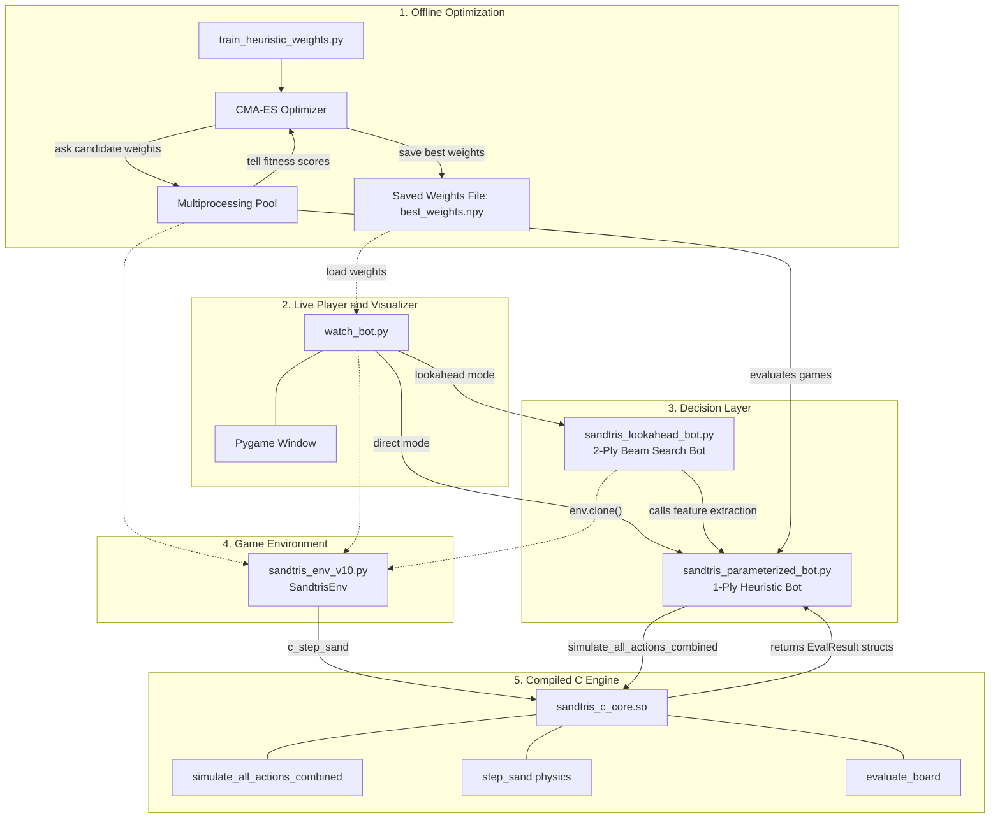
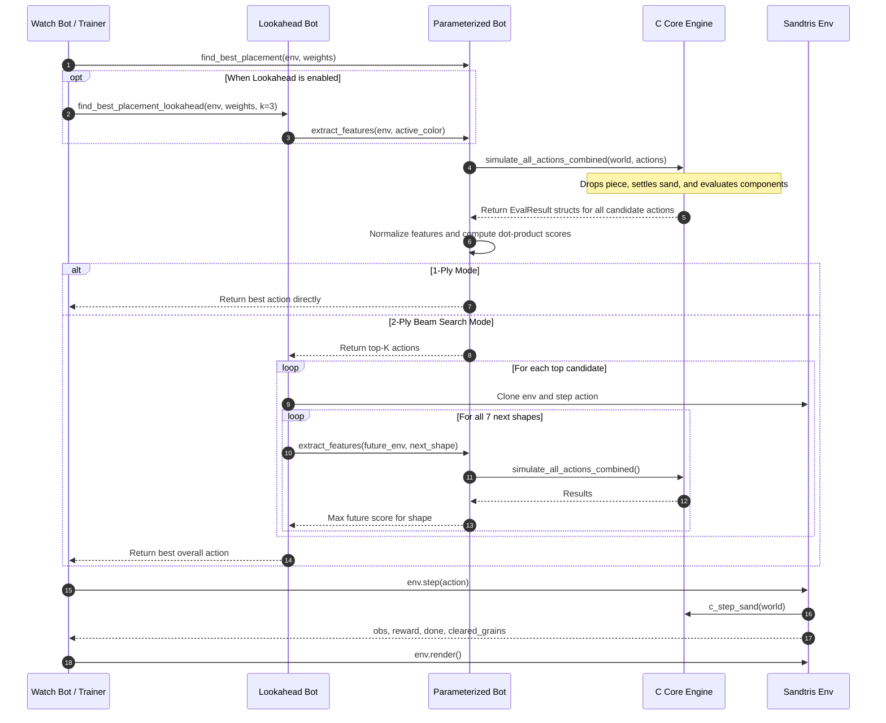

# Sandtris AI: High-Performance Heuristic Search & Evolutionary Optimization for Falling-Sand Tetris

[](#)
[](#)
[](#)
[](#)

---
> To see the best model play, just clone the repo and run:
> ```python watch_bot.py --mode clipped --run_id 2 --lookahead ```

## Overview

<div align="center">
  

https://github.com/user-attachments/assets/c5db11b7-b383-4417-9b5e-58cd35a53ae9


  <p><em>The best bot achieving sustained, master level play (15,000+ steps/pieces) via 2-step Expectimax lookahead.</em></p>
</div>

**Sandtris AI** is a bot built to play the sand based Tetris game Sandtris which rose to popularity online in the last few years. 

For those who are not familiar with the game, the main mechanics are:
* The board is based on grains, not blocks. Each tetromino has 100 grains (5*5 per block for 4 blocks) which shatters when the piece lands.
* The grains follow a sand flowing automata, falls down, or left/right if it can.
* Each grain (and piece) has a color (red green yellow blue), and the clearing mechanic isn't based on lines but monochromatic clusters that touch both walls. A cluster of any shape or form that touches both sides clears. Only grains of the same color that touch orthogonally can form clusters.
And that's about it. 

The aim of the project from the start was to essentially solve this game with whatever means necessary. Trying many approaches from hand crafted heuristics to RL, nearly all of them either resulted in absolute failures (cannot even reach 200 steps/pieces), or at most "meh" results (maxing out at 500 steps).

Then after choosing to abandon Deep RL altogether and shifting to making an optimizer for a 24 feature heuristic model using CMA-ES, I was finally able to make a bot that not only beat my previous models by a mile going from 500 to 5,000 steps, but also beat my new record holder shortly after thanks to implementing a lookahead. The best model I have in hand after under 60 mins of training managed to last over 15k in 3.5 hours, ~0.84 second per piece, in the first run I did. 

Could it last longer? Probably, it is not immortal, the bot eventually faced such a bad sequence of colors that it was just game over. After all the color of the piece matters so much: if you are very close to clearing with let's say blue, and the next best color is green, and the game rng just gives you red and yellow so you end up burying the good clusters. But then right after they are buried the game starts giving you blues/greens, ruining the red/yellow clusters too. 

Despite the element of bad luck catching up to you at some point, there still could be room left to explore to make it **actually** immortal rather than _practically_ immortal. However, I wouldn't be surprised if my model could be very close to a "perfect" one achievable with a relatively lightweight solution, and for other reasons I go deeper into at [section 2](#2-the-sandtris-challenge) questions 4-5.

**Important Note on the AI Approach:**  Despite the project's historical name, the high performing **Master Bot is NOT powered by Deep Reinforcement Learning**. Standard deep neural networks (such as PPO and DQN with CNNs) struggle severely with Sandtris due to reward sparsity, non-rigid fluid dynamics, and spatial sensitivity. 

Instead, the Master Bot achieves near immortal performance through a **engineered 24-dimensional feature extractor, non-linear clipping bounds ("accidental logic gates"), a parameter vector optimized via CMA-ES (Covariance Matrix Adaptation Evolution Strategy), and a 2-step Expectimax beam search lookahead** backed by a C physics core.

However, **the complete Gymnasium compliant environment (sandtris_env_v10.py)** is fully intact and included in this repository for anyone interested in experimenting, benchmarking, or training their own custom RL algorithms (PPO, DQN, A2C, etc.) on Sandtris.

---

## Table of Contents
1. [Gameplay Demonstrations](#1-gameplay-demonstrations)
2. [The Sandtris Challenge](#2-the-sandtris-challenge)
3. [CMA-ES and the 24-Dimensional Feature Space](#3-cma-es-and-the-24-dimensional-feature-space)
4. [The "Accidental Logic Gate" Clipping Breakthrough](#4-the-accidental-logic-gate-clipping-breakthrough)
5. [The Champion Weights](#5-the-champion-weights)
6. [System Architecture](#6-system-architecture)
7. [File-by-File](#7-file-by-file)
8. [Benchmark Performance & Results](#8-benchmark-performance--results)
9. [Installation & Quickstart Guide](#9-installation--quickstart-guide)
10. [Repository Map](#10-repository-map)

---


## 1. Gameplay Demonstrations

Below is a comparison of different gameplay strategies. The human gameplay and the 2-step master bot are both sped up to give a better idea of the overall look of the gameplay. Human (my) gameplay is about ~2 seconds per piece, the 2-step lookahead bot is ~0.84s per piece.

| 1. Human Gameplay | 2. Traditional Heuristic Bot |
| :---: | :---: |
| https://github.com/user-attachments/assets/c7ab3224-5934-4f2c-8687-7dc5037b8e9c | https://github.com/user-attachments/assets/17a7bcaf-3331-4da0-b17d-45908d1f4f09 |
| *Human play. (Speed up)* | *Handcrafted heuristic bot. Only optimizing total closeness to finishing. Survival: ~150 steps. (No speed up)* |
| **3. 1-Step Parameterized Bot** | **4. Master Bot (2-Step Lookahead)** |
| https://github.com/user-attachments/assets/e7c90c7a-efb5-4c3f-908c-781bc713d27d | https://github.com/user-attachments/assets/a57ce6b0-8361-475e-8001-6aa8525dae42 |
| *1-step CMA-ES optimized bot with non-linear clipping gates. Survival: ~5,000 steps. (No speed up)* | *2-step lookahead. Survival: 15,000+ steps. (Speed up)* |

## 2. The Sandtris Challenge

### 1. What is easy for humans?
* **Predicting Settling Sand**: Unlike rigid Tetris, pieces shatter into 100 grains obeying a **$45^\circ$ angle of repose cellular automaton**: grains fall vertically or slide diagonally down slopes until they can't. A human can intuitively tell how the grains will fall and settle before even piece touches the ground, e.g. how to use avalanches to span many columns, or valleys to prevent it.
* **Clearing**: Clears require a **continuous, monochromatic connected group spanning from wall to wall**, not a flat horizontal row. No two clear looks the same, so the clearing procedure is just difficult to anticipate and generalise. However it is still generalisable enough to humans to produce consistent gameplay.
* **Burial Protection**: Dropping the wrong color over a developing path buries it beneath a 30 pixel sand dune, trapping that color for many moves. Deciding to protect the clusters close to clearing or not is a key part of the games strategt and this ability is also a result of the grain-fall intution we mentioned. 

### 2. Why does Model-Free Deep RL (PPO / DQN) fail?
*Model-free* agents have no internal physics simulator (can't calculate grain falling), they act blindly from raw observation frames and trial-and-error:
* **Translational Invariance Breaks**: Shifting a dune by 2 pixels changes raw CNN activations completely despite identical physics.
* **Extreme Reward Sparsity**: Spanning 85 columns takes ~4-6 drops of the same color, but pieces cycle randomly across 4 colors. A random agent carelessly drops other colors over developing paths, burying and fragmenting them. Achieving a clear by random trial-and-error has a very low probability, so the agent can receives extremely sparse rewards for playing even millions of steps.
* **Credit Assignment**: With games lasting thousands of moves, model-free networks cannot determine which of the last 30 drops set up a clear.

### 3. Why not Model-Based RL (World Models)?
* Neural networks trained to predict next-state sand physics are slow  and violate mass conservation (hallucinating or deleting grains).
* We already have an exact simulator: our **C-core runs 200 iterations in 0.2 ms**.

### 4. Could C-Core simulation + Deep RL (AlphaZero style) work?
In theory, an AlphaZero setup (tree search using the C-core + a Deep CNN Value Network) is sound. However, in practice it suffers from a few issues:
* **Search Performance**: 2-step lookahead evaluates hundreds of candidate boards per move. Our 24-feature linear scorer takes **15 ms total on CPU**. Passing batches through a Deep CNN takes 300–1,000 ms, destroying real-time 60 FPS play.
* **Precision (1-Pixel Gaps)**: CNN convolutional filters blur spatial details. A line clear requires exact 1-pixel diagonal connectivity; CNNs struggle to distinguish closed vs. broken paths. Our C BFS flood-fill checks this with 100% precision.
* **15,000-Step Value Drift**: Sandtris games last 15,000+ steps if played correctly. Deep value networks suffer massive Bellman bootstrapping error over such horizons, whereas our 24 physical features + CMA-ES already converges in 20-30 mins, and achieves near-immortal play in **about 50 minutes of total training on a single laptop CPU.**

### 5. Why CMA-ES over Policy Gradients to optimize weights?
Once moves are projected onto a 24-dimensional feature vector $\mathbf{\phi}_a$, we score them as $\text{Score} = \mathbf{w} \cdot \mathbf{\phi}_a$ and pick $\arg\max$:
* **Non-Differentiable $\arg\max$**: The gradient of $\arg\max$ with respect to $\mathbf{w}$ is zero almost everywhere, causing standard policy gradients to fail or suffer massive variance.
* **Episode-Level Fitness**: CMA-ES optimizes total survival and cleared grains as a black-box fitness function, bypassing per-step reward shaping and gradient backpropagation.
* **The Sweet Spot 24**: Evolutionary strategies degrade in high dimensions, but for 24 parameters, CMA-ES directly models the exact $24 \times 24$ covariance matrix of feature trade-offs, converging in 20–30 generations.

### 6. Why only 24 features instead of hundreds or thousands?
* **Curse of Dimensionality in CMA-ES**: At $D=24$, the $24 \times 24$ covariance matrix updates in microseconds with a population of 20. Millions of parameters would make CMA-ES intractable ($O(D^2)$ to $O(D^3)$).
* **Zero Overfitting**: Every feature reflects universal physical invariants (ceiling risk, surface roughness, cluster mass, wall anchoring, background defense) that hold on every seed.
* **15 ms Inference**: Features are extracted in a single BFS flood fill pass inside the C-core, maintaining 60 FPS real time lookahead.
* **Full Interpretability**: Learned weights can be audited directly (e.g. $+4.80$ clears, $-2.00$ roughness, $-3.17$ overhangs).

---

## 3. CMA-ES and the 24-Dimensional Feature Space

### Candidate Actions, Scoring, and CMA-ES Optimization

The bot does not steer pieces frame by frame through the air. Instead, its gameplay is choosing drop placements:
* **The Action Space ($a$)**: An action is defined by a column and a rotation: $a = (\text{column}, \text{rotation})$. While the underlying sand grid is 85 pixels wide, candidate drops are discretized into 17 "block columns" (stepping by 5 pixels, since each tetromino block is $5 \times 5$ grains). Across 17 columns and 4 rotations, the bot evaluates up to **68 candidate placements** per turn (~50–64 unique valid drops after boundary clamping).
* **Forward Simulation & Scoring**: For each candidate placement $a$, our compiled C-core simulates the piece falling, shattering, and settling into the sandbed (computing 200 physics iterations in 0.2 ms). From this settled board, the bot extracts a **24-dimensional feature vector** $\mathbf{\phi}(a)$ and evaluates it via a linear weighted sum:
  $$\text{Score}(a) = \mathbf{w} \cdot \mathbf{\phi}(a) = \sum_{i=0}^{23} w_i \cdot \phi_i(a)$$
* **Action Selection**:
  * **1-Step Bot**: Directly executes the placement with the highest score: $a^* = \arg\max_a \text{Score}(a)$.
  * **2-Step Master Bot**: Takes the top-scoring placements from Step 1 and evaluates them across all 7 future tetromino shapes using Expectimax beam search.

### How CMA-ES Finds the Optimal Weights $\mathbf{w}$
The bot's entire playing style depends on the 24 weights in $\mathbf{w}$—determining how heavily it values line clears, penalizes bumpy terrain, or protects developing color clusters. Rather than hand-tuning these 24 parameters, we optimize $\mathbf{w}$ using **CMA-ES (Covariance Matrix Adaptation Evolution Strategy)**:
1. **Sample Candidate Policies**: In each generation, CMA-ES samples a population of 20 candidate weight vectors ($\mathbf{w}_1, \dots, \mathbf{w}_{20}$) from a multivariate Gaussian distribution $\mathcal{N}(\mathbf{\mu}, \mathbf{\Sigma})$ over the 24-dimensional parameter space.
2. **Evaluate Full Episodes**: Each candidate $\mathbf{w}_k$ controls a bot across complete Sandtris games, choosing moves via $\arg\max_a (\mathbf{w}_k \cdot \mathbf{\phi}_a)$. Its performance is measured by an episode-level fitness function:
   $$\text{Fitness}(\mathbf{w}) = \text{Steps Survived} + \text{Grains Cleared}$$
3. **Adapt the Covariance Matrix**: CMA-ES ranks the 20 candidates by fitness, shifts the distribution mean $\mathbf{\mu}$ toward the top performers, and updates the $24 \times 24$ covariance matrix $\mathbf{\Sigma}$ to reinforce search along the parameter directions that correlated with high survival.
4. **Convergence**: Because the parameter space is strictly 24-dimensional (avoiding the curse of dimensionality), CMA-ES converges to near-immortal weights in just **20 to 30 generations** (~20 minutes on a standard CPU).

---

### The 24 Engineered Physical Features
Following each simulated drop, the settled sandbed is projected onto 24 normalized features $\mathbf{\phi}(a) \in [0, 1]^{24}$ extracted in a single BFS flood-fill pass inside the C-core. They are structured into three distinct functional groups:

#### Group 1: Global Board Geometry & Clear Signals ($\phi_0 - \phi_4$)
* **$\phi_0$ (`cleared`)**: Total number of sand grains eliminated by this move. Captures immediate path clears.
* **$\phi_1$ (`max_height`)**: Height of the highest sand column from the floor ($0 - 150$). Directly measures ceiling danger and top-out risk.
* **$\phi_2$ (`bumpiness`)**: Sum of absolute height differences between adjacent columns: $\sum_{x=0}^{83} |h_x - h_{x+1}|$. Low values indicate a flat, even sandbed that allows future pieces to slide smoothly.
* **$\phi_3$ (`flow`)**: Dynamic lateral settling metric measuring how effectively sand spreads horizontally across valleys rather than stacking vertically.
* **$\phi_4$ (`bridge`)**: Horizontal span of uncleared clusters. Acts as a penalty against creating overhangs, lingering residues, or dead-end ledges.

#### Group 2: Active Color Growth & Anchoring ($\phi_5 - \phi_{11}$)
Evaluates the sand matching the color of the active falling piece:
* **$\phi_5$ (`gap_active`)**: Shortest remaining pixel distance for any *single connected cluster* of this color to reach from wall to wall.
* **$\phi_6$ (`gap_blockage`)**: Global bounding box span across all grains of this color. Detects whether the active color is anchored to a boundary wall or floating aimlessly in the center.
* **$\phi_7$ (`comp_count`)**: Number of separate, disconnected clusters of this color. High values indicate messy, fragmented confetti; low values indicate clean, unified masses.
* **$\phi_8$ (`max_comp_size`)**: Grain count of the largest single cluster of this color. Measures progress toward accumulating enough volume to span 85 columns.
* **$\phi_9$ (`exposed_pixels`)**: Number of grains of this color touching air. Buried sand is inert; only exposed surface grains can connect with future pieces.
* **$\phi_{10}$ (`useful_frontier`)**: Surface grains of this color that touch open sky (`air_mask`) AND face toward the target wall they are trying to reach.
* **$\phi_{11}$ (`color_gaps`)**: Shortest path deficit across the board for the active color.

#### Group 3: Inactive Background Color Preservation ($\phi_{12} - \phi_{23}$)
There are 4 colors in Sandtris. While the active piece is Color $A$, the other 3 colors ($O_1, O_2, O_3$) are already resting on the board. The bot **sorts the inactive colors by their proximity to completing a line clear**:
* **$O_1$**: The inactive color **closest** to completing a line clear (most urgent to protect).
* **$O_2$**: The second closest inactive color.
* **$O_3$**: The furthest / least developed inactive color.

For each inactive color, the bot tracks 4 identical metrics:
* **$\phi_{12}, \phi_{16}, \phi_{20}$ (`color_gaps`)**: Distance remaining to clear for $O_1, O_2, O_3$.
* **$\phi_{13}, \phi_{17}, \phi_{21}$ (`gap_blockage`)**: Wall anchoring status for $O_1, O_2, O_3$.
* **$\phi_{14}, \phi_{18}, \phi_{22}$ (`max_comp_size`)**: Mass of the largest cluster for $O_1, O_2, O_3$.
* **$\phi_{15}, \phi_{19}, \phi_{23}$ (`useful_frontier`)**: Open surface accessibility for $O_1, O_2, O_3$.

> **Why Inactive Colors Matter**: Without tracking $O_1, O_2, O_3$, a bot would be color-blind to the rest of the board. It might place a green piece in a spot that looks favorable for green, but buries an almost-completed yellow line under sand. Tracking inactive colors allows the bot to learn negative weights (penalties) for moves that ruin future clears.

---

## 4. The "Accidental Logic Gate" Clipping Breakthrough

Each raw feature $x_i$ is normalized to $[0.0, 1.0]$ via:

$$\phi_i = \text{clip}\left(\frac{x_i - \min_i}{\max_i - \min_i}, 0.0, 1.0\right)$$

In early development, normalization bounds in `CLIPPED_BOUNDS` were set to narrow empirical thresholds rather than true mathematical maxima:

```python
CLIPPED_BOUNDS = [
    (0, 4),      # 0. cleared (Actual clears: 85 to 400+ grains)
    (0, 150),    # 1. max_height
    (0, 2000),   # 2. bumpiness
    (0, 2.0),    # 3. flow
    (0, 2.0),    # 4. bridge (Actual spans: 85+)
    
    # Active Color
    (0, 85),     # 5. gap_active
    (0, 100),    # 6. gap_blockage (Floating sand receives offset of 1000+)
    (0, 20),     # 7. comp_count
    (0, 4000),   # 8. max_comp_size
    (0, 500),    # 9. exposed_pixels
    (0, 300),    # 10. useful_frontier
    (0, 85),     # 11. color_gaps
    
    # Inactive O1, O2, O3 (4 features each)
    (0, 85), (0, 100), (0, 4000), (0, 300),
    (0, 85), (0, 100), (0, 4000), (0, 300),
    (0, 85), (0, 100), (0, 4000), (0, 300),
]
```

### The Revelation: Linear Models vs. Non-Linear Clipping
* **`cleared` clipped at 4**: A true line clear eliminates 85 to 200+ grains. Because `max = 4`, any clear immediately saturates to $1.0$. This transformed `cleared` into a binary indicator function:
  $$\phi_0 \approx \mathbb{I}(\text{Did this move clear sand?})$$
* **`gap_blockage` clipped at 100**: In C, unanchored floating sand is given a penalty offset of $1000 + \text{dist}$. Because the bound was set to `(0, 100)`, any floating cluster saturated hard to $1.0$, while anchored clusters remained below $0.85$. This acted as an "IS IT FLOATING?" boolean gate.

### Why Clipping Dominated
In comparative experiments over 20 generations of CMA-ES:
* **Linear Mode** (normalized against theoretical maxima like $2,000$): **Flatlined below 15,000 fitness**. A 1,500-grain cave produced a penalty 15 times larger than a 100-grain cave, causing the linear model to panic and drop pieces at the top of the board to avoid it.
* **Clipped Mode**: **Exceeded 98,000 fitness**. The bot treated any large cave as a categorical boolean *"Danger (1.0)"*. Once danger was recognized, the model's remaining weights focused on finding the cleanest landing surface.

By clipping continuous features into narrow ranges, a simple linear dot product gained the expressive power of **decision trees and threshold logic gates**.

---

## 5. The Champion Weights

After running (`train_heuristic_weights.py`) for 20 genenerations at 20 popsize (20 candidate game per gen) at 1.0 standard deviation, then another 20 gens, 20 popsize, 0.33 std to fine-tune (total training time was below 1 hour on my laptops CPU), CMA-ES converged on the following 24-dimensional champion weight vector (`best_clipped_weights_run2.npy`):

```python
CHAMPION_WEIGHTS = [
    # --- Group 1: Board Geometry & Clear Signals ---
    4.7986,  #  0: cleared       -> MASSIVE REWARD: +4.80 to immediately complete lines
   -0.8765,  #  1: max_height    -> Penalty for high sand piles / top-out danger
   -2.0024,  #  2: bumpiness     -> Strong penalty for rough terrain (favors smooth flats)
    1.8665,  #  3: flow          -> Reward for lateral sand settling into valleys
   -3.1716,  #  4: bridge        -> HEAVY PENALTY: Never leave floating overhangs/ledges

    # --- Group 2: Active Color Growth & Anchoring ---
   -2.7891,  #  5: gap_active    -> Penalize remaining distance to clear
    1.9446,  #  6: gap_blockage  -> Reward anchoring clusters against the boundary walls
   -1.0931,  #  7: comp_count    -> Penalize fragmented confetti clusters
    0.3810,  #  8: max_comp_size -> Reward growing large unified color masses
   -2.1062,  #  9: exposed_pixels-> Keep active surface compact
   -2.5384,  # 10: useful_frontier-> Guide surface growth toward the target wall
   -1.4736,  # 11: color_gaps    -> Penalize board-wide path deficits

    # --- Group 3: Inactive Background Color Preservation ---
    # O1 (Closest inactive color to completing a clear):
   -0.4735,  # 12: color_gaps    -> Defend O1's clearing path
   -0.6907,  # 13: gap_blockage  -> Avoid disrupting O1's wall anchoring
    1.4085,  # 14: max_comp_size -> Keep O1's largest cluster intact
   -2.1112,  # 15: useful_frontier-> HEAVY PENALTY if active drop buries O1's surface

    # O2 (Second closest inactive color):
    2.6848, -0.6116,  2.8603,  1.1168,  # 16-19: Moderate background maintenance

    # O3 (Least developed inactive color):
    0.9314,  0.1398,  0.0483,  0.8156   # 20-23: Low priority background maintenance
]
```

---

## 6. System Architecture







---

## 7. File-by-File

### 1. `sandtris_c_core.c` / `.so` (C-core Engine)
The compiled backbone of the system. The entire $150 \times 85$ board is 12.75 KB, allowing it to reside permanently within the CPU's **L1 data cache**:
* **Gravity Kernel (`step_sand`)**:
  * Scans bottom-up (`y = 148` down to `0`) so grains drop at uniform terminal velocity.
  * Implements $45^\circ$ diagonal sliding with parity alternation `((x + y + iter) % 2 == 0)` to eliminate directional drift.
  * Runs for up to 200 iterations with early exit when sand settles.
* **Component Labeling (`evaluate_board`)**:
  * Uses a static non-recursive stack (zero `malloc` calls during search).
  * Performs 4-way flood fill to label single-color connected components and detect wall-to-wall path clears.
* **Frontier & Sky Reachability (`evaluate_frontier_board`)**:
  * Flood-fills air from the sky row ($y=0$) into `air_mask` to ignore subterranean caves.
  * Computes target-facing useful frontiers and kinetic flow metrics.
* **Batch Master Simulator (`simulate_all_actions_combined`)**:
  * Receives all 68 candidate moves in flat arrays.
  * Simulates the drop, sand settlement, and evaluations in a single C invocation, returning populated `EvalResult` and `EvalFrontierResult` structs.

### 2. `sandtris_env_v10.py` (Gymnasium Environment)
Manages the canonical game state and exposes standard Gym APIs:
* Maintains the persistent $150 \times 85$ NumPy grid, active piece coordinates, color states, and step counts.
* Decodes discrete actions into column and rotation: `rot_idx = action // 17`, `block_col = action % 17`.
* `clone()` method creates deep copies of the environment state for lookahead tree search.
* Calls `_c_core.c_step_sand` for true in-game physical settlement.

### 3. `sandtris_parameterized_bot.py` (1-Step Decision Engine)
Converts raw simulation data into action decisions:
* Formulates candidate geometries for all 68 possible actions.
* Dispatches geometries to `simulate_all_actions_combined` via `ctypes`.
* Assembles the 24-dimensional feature matrix $\mathbf{\Phi}$ ($68 \times 24$).
* Normalizes features using `CLIPPED_BOUNDS`.
* Computes placement scores via dot product: $\mathbf{s} = \mathbf{\Phi} \mathbf{w}$.
* Returns $\arg\max(\mathbf{s})$.

### 4. `sandtris_lookahead_bot.py` (2-Step Beam Search Engine)
Implements depth-2 Expectimax lookahead:
* Takes top-$K$ actions ($K=3$) from the 1-ply bot.
* For each candidate action:
  1. Clones the environment (`env.clone()`) and applies the move.
  2. Projects the next turn across all 7 standard tetromino shapes (`SHAPES`).
  3. Computes the maximum score achievable for each shape using the learned weights.
  4. Computes the expected future score: $\mathbb{E}[\text{Future Score}] = \frac{1}{7} \sum_{s=1}^7 \max_{a'} \text{Score}(a' \mid s)$.
* Selects the move maximizing $\text{BaseScore} + 0.85 \times \mathbb{E}[\text{Future Score}]$.

### 5. `train_heuristic_weights.py` (CMA-ES Evolutionary Trainer)
Manages the parallel evolutionary optimization pipeline:
* Spawns worker processes using `multiprocessing.set_start_method('spawn')` for safe C-library sharing.
* Evaluates 20 candidates per generation across fixed random seeds.
* Tracks progress via `tqdm`, logging best and average generation fitness.
* Saves learned weights to `best_{mode}_weights_run{id}.npy`.

### 6. `watch_bot.py` (Visualizer)
The live Pygame frontend:
* Loads learned weights from `.npy` files.
* Supports toggling between 1-step fast mode (~300 FPS) and 2-step lookahead mode (`--lookahead`).
* Displays step counts, cleared grain tallies, and per-turn thinking time in the terminal.

---

## 8. Benchmark Performance & Results

### Simulation & Search Latency

| Operation | Pure Python | C-Core (`sandtris_c_core.so`) | Speedup |
| :--- | :--- | :--- | :--- |
| **Single Move Physics & Settlement** | 29.4 ms | **0.22 ms** | **133x** |
| **All 68 Candidate Actions Evaluated** | 2,010 ms | **18.5 ms** | **108x** |
| **CMA-ES Generation Time (20 pop, 3 seeds)** | 62.5 minutes | **1.5 minutes** | **41x** |

### Clear Rates

| Strategy / Agent | Mean Steps Survived | Total Grains Cleared |
| :--- | :--- | :--- |
| **Random Baseline** | $32 \pm 6$ | $0$ |
| **Traditional Handcrafted Heuristics** | $145 \pm 38$ | $210 \pm 85$ |
| **1-step Linear Heuristics (True Bounds)**| $180 \pm 45$ | $340 \pm 110$ |
| **1-step Clipped Bot (Gen 20)** | $1,000$ (capped) | $88,400$ |
| **1-step Clipped Bot (Uncapped)** | $4,850 \pm 420$ | $420,000+$ |
| **Master Bot (2-Ply Lookahead)** | **15,032+** | **1,400,000+** | 

---

## 9. Installation & Quickstart Guide

### Prerequisites
* GCC or Clang (supporting C99)
* Python 3.9+
* Required packages:

```bash
pip install numpy pygame gymnasium tqdm cma scipy
```

### 1. Compile the C-Core
If it is not already, compile `sandtris_c_core.c` with `-O3` optimizations:

```bash
# macOS / Linux
gcc -O3 -shared -fPIC sandtris_c_core.c -o sandtris_c_core.so
```

### 2. Watch the Trained Bot in Action
Run the interactive visualizer with the pre-trained champion weights (`best_clipped_weights_run2.npy`):

```bash
# 1-Ply Fast Decision Mode (~300 FPS)
python watch_bot.py --mode clipped --run_id 2

# Master Bot Mode (2-Ply Lookahead Beam Search)
python watch_bot.py --mode clipped --run_id 2 --lookahead
```

### 3. Run Training From Scratch
To train new weights from scratch or fine-tune existing weights:

```bash
# Train from scratch for 20 generations
python train_heuristic_weights.py --mode clipped --generations 20 --run_id 1

# Resume from Run 1 and fine-tune with reduced variance (0.33x)
python train_heuristic_weights.py --mode clipped --resume_from 1 --generations 20 --run_id 2
```

---

## 10. Repository Map

```
sandtrisRLnew/
├── sandtris_c_core.c              # Core C physics engine, BFS components & batch evaluators
├── sandtris_c_core.so             # Compiled shared library (generated via gcc)
├── sandtris_env_v10.py            # Gymnasium environment with canonical sand simulation
├── sandtris_parameterized_bot.py  # 1-ply feature extractor (24 features) & linear scorer
├── sandtris_lookahead_bot.py      # 2-ply Expectimax lookahead beam search engine
├── train_heuristic_weights.py     # Multiprocessing CMA-ES evolutionary training pipeline
├── watch_bot.py                   # Live Pygame viewer (supports 1-ply and lookahead)
├── best_clipped_weights_run2.npy  # Gen 40 fine-tuned champion weights (Run 2)
├── assets/                        # Gameplay demos
└── README.md                      # README
```
