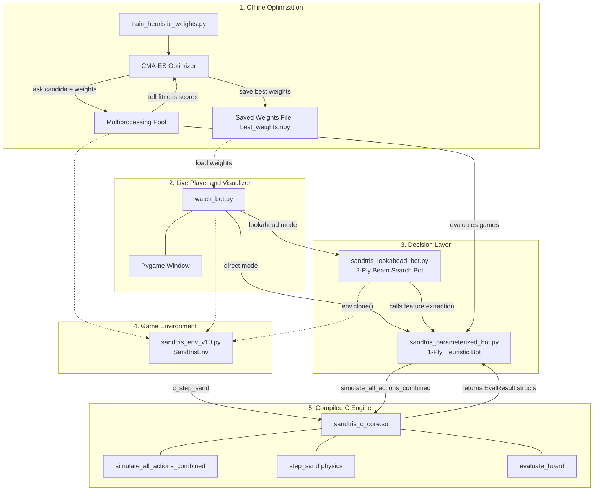
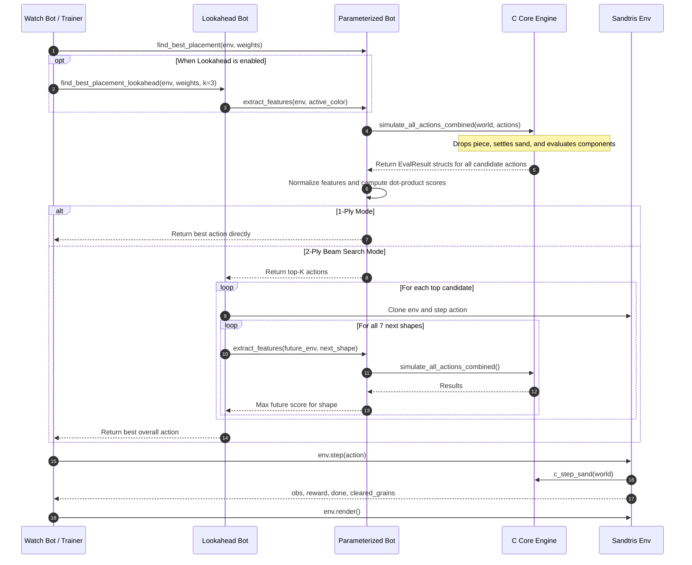

# Sandtris AI: High-Performance Heuristic Search & Evolutionary Optimization for Falling-Sand Tetris

[](#)
[](#)
[](#)
[](#)

---

## Overview

<div align="center">
  
  <p><em>The Master Bot achieving sustained, grandmaster-level play (15,000+ steps) via 2-ply Expectimax lookahead.</em></p>
</div>

**Sandtris AI** is an autonomous game-playing system built to solve the notoriously chaotic dynamics of **Falling-Sand Tetris**. When a tetromino lands in Sandtris, its rigid structure shatters into 100 independent grains of sand that collapse under gravity and slide into adjacent valleys. 

> **Important Note on the AI Approach:**  
> Despite the project's historical name, the high-performing **Master Bot is NOT powered by Deep Reinforcement Learning (RL)**. Standard deep neural networks (such as PPO and DQN with CNNs) struggle severely with Sandtris due to extreme reward sparsity, non-rigid fluid dynamics, and spatial sensitivity. Instead, the Master Bot achieves near-immortal performance through a **carefully engineered 24-dimensional topological feature extractor, non-linear clipping bounds ("accidental logic gates"), a parameter vector optimized via CMA-ES (Covariance Matrix Adaptation Evolution Strategy), and a 2-ply Expectimax beam search lookahead** backed by a compiled C physics core.

*Curious about the engineering, mathematics, and architecture behind the bot? Scroll down for the complete deep dive.*

---

## Table of Contents
1. [Gameplay Demonstrations](#1-gameplay-demonstrations)
2. [The Sandtris Challenge: Why It Is Notorious for Computers](#2-the-sandtris-challenge-why-it-is-notorious-for-computers)
3. [The 24-Dimensional Feature Space](#3-the-24-dimensional-feature-space)
4. [The "Accidental Logic Gate" Clipping Breakthrough](#4-the-accidental-logic-gate-clipping-breakthrough)
5. [CMA-ES Evolutionary Optimization](#5-cma-es-evolutionary-optimization)
6. [System Architecture](#6-system-architecture)
7. [File-by-File Technical Deep Dive](#7-file-by-file-technical-deep-dive)
8. [Benchmark Performance & Results](#8-benchmark-performance--results)
9. [Installation & Quickstart Guide](#9-installation--quickstart-guide)
10. [Repository Map](#10-repository-map)

---

## 1. Gameplay Demonstrations

Below is a comparison of different gameplay strategies, illustrating the progression from human intuition and early heuristic baselines to the grandmaster Master Bot:

| 1. Human Gameplay | 2. Traditional Heuristic Bot |
| :---: | :---: |
|  |  |
| *Human play relying on visual intuition and gestalt recognition. Survival: ~200–500 steps.* | *Handcrafted heuristic baseline without evolutionary weights. Survival: ~150 steps.* |
| **3. 1-Ply Parameterized Bot** | **4. Master Bot (2-Ply Lookahead)** |
|  |  |
| *1-ply CMA-ES optimized bot with non-linear clipping gates. Survival: ~4,800 steps.* | *2-ply Expectimax beam search evaluating 7 future tetromino shapes. Survival: 15,000+ steps.* |

---

## 2. The Sandtris Challenge: Why It Is Notorious for Computers

To understand why traditional Game AI methods fail so catastrophically at Sandtris, one must appreciate how fundamentally it differs from classical discrete Tetris.

```
Classical 1984 Tetris (Discrete, Rigid)        Sandtris (Continuous Granular Fluid Dynamics)
┌─────────────────────────────────┐            ┌───────────────────────────────────────────┐
│  [ ] [ ] [ ] [ ] [ ] [ ] [ ]    │            │            . : : .   (Sand Dune Peak)     │
│  [X] [X] [X] [X] [X] [X] [X]    │ <- 1 Row   │          . : : : : .                      │
│  [X] [ ] [X] [X] [ ] [X] [X]    │   Clear    │      . : : ~Red Path~ : : . <- Path Clear!│
└─────────────────────────────────┘            │     : : : : : : : : : : : : :             │
                                               └───────────────────────────────────────────┘
```

### 1. Human Visual Gestalt vs. Computer Lattice Perception
* **How humans see the board**: A human player glances at Sandtris and instantly perceives continuous color bands, macroscopic slopes, and natural funnel crevices. Humans do not count pixels; they use intuitive physics and fluid gestalt recognition to drop pieces where sand will naturally slide into gaps.
* **How a computer sees the board**: A computer must process an **$85 \times 150$ grid containing 12,750 independent cells**, each of which can hold one of 4 colors or air ($4^{12,750}$ potential states). There are no rigid objects, fixed bounding boxes, or static reference points.

### 2. The Mechanics of Granular Avalanches
In classical Tetris, a piece stays exactly where it lands. In Sandtris, every piece shatters into 100 grains upon contact. Each grain is governed by a **cellular automaton with a $45^\circ$ angle of repose**:
* If the space below is free, sand falls vertically.
* If blocked, sand spills laterally down-left or down-right.
* This means dropping a piece on column 40 can trigger an avalanche that spills into column 35 and column 45, completely altering the terrain across multiple columns.

### 3. Topological Percolation vs. Flat Row Clears
A line clear in Sandtris is **not** a filled horizontal row. Instead, a clear is a **continuous, monochromatic connected component** connecting the left wall ($x=0$) to the right wall ($x=84$):
* The clearing path can be jagged, diagonal, or undulating like a snake.
* When a path clears, all grains in that connected component vanish, and the massive sand mountain above it undergoes dynamic gravitational collapse into the newly formed void.

### 4. Irreversible State Corruption
A single poorly placed piece of the wrong color can spill over a nearly finished line, burying that color beneath a 30-pixel-deep sand dune. In classical Tetris, you can dig through bad placements row-by-row. In Sandtris, **burying a color often renders it permanently inaccessible for the next 40 to 60 moves**, causing an unrecoverable downward spiral.

### 5. Why Deep Reinforcement Learning (CNNs / PPO / DQN) Fails
1. **Translational Invariance Breaks Down**: CNN convolutional kernels rely on patterns looking the same regardless of position. But two sand dunes of identical volume and color look completely different to a CNN if one has shifted sideways by just 2 pixels during an avalanche.
2. **Extreme Reward Sparsity**: Clearing a path requires 15 to 40 consecutive moves of carefully building up matching colors across an 85-column expanse. A randomly exploring RL agent almost never sees a reward, making temporal credit assignment practically impossible.
3. **Action Space Mismatch**: Frame-by-frame steering (left/right/rotate/drop) wastes 99% of training time learning joystick coordination rather than learning long-term topological planning.

---

## 3. The 24-Dimensional Feature Space

To evaluate candidate placements efficiently, the game state following each simulated drop is projected onto a **24-dimensional feature vector** $\mathbf{\phi}(a)$:

$$\text{Score}(a) = \sum_{i=0}^{23} w_i \cdot \phi_i(a)$$

The features are organized into three distinct operational groups:

### Group 1: Global Board Geometry & Clear Signals ($\phi_0 - \phi_4$)
* **$\phi_0$ (`cleared`)**: Total number of sand grains eliminated by this move. Captures immediate path clears.
* **$\phi_1$ (`max_height`)**: Height of the highest sand column from the floor ($0 - 150$). Directly measures ceiling danger and top-out risk.
* **$\phi_2$ (`bumpiness`)**: Sum of absolute height differences between adjacent columns: $\sum_{x=0}^{83} |h_x - h_{x+1}|$. Low values indicate a flat, even sandbed that allows future pieces to slide smoothly.
* **$\phi_3$ (`flow`)**: Dynamic lateral settling metric measuring how effectively sand spreads horizontally across valleys rather than stacking vertically.
* **$\phi_4$ (`bridge`)**: Horizontal span of uncleared clusters. Acts as a penalty against creating overhangs, lingering residues, or dead-end ledges.

### Group 2: Active Color Growth & Anchoring ($\phi_5 - \phi_{11}$)
Evaluates the sand matching the color of the active falling piece:
* **$\phi_5$ (`gap_active`)**: Shortest remaining pixel distance for any *single connected cluster* of this color to reach from wall to wall.
* **$\phi_6$ (`gap_blockage`)**: Global bounding box span across all grains of this color. Detects whether the active color is anchored to a boundary wall or floating aimlessly in the center.
* **$\phi_7$ (`comp_count`)**: Number of separate, disconnected clusters of this color. High values indicate messy, fragmented confetti; low values indicate clean, unified masses.
* **$\phi_8$ (`max_comp_size`)**: Grain count of the largest single cluster of this color. Measures progress toward accumulating enough volume to span 85 columns.
* **$\phi_9$ (`exposed_pixels`)**: Number of grains of this color touching air. Buried sand is inert; only exposed surface grains can connect with future pieces.
* **$\phi_{10}$ (`useful_frontier`)**: Surface grains of this color that touch open sky (`air_mask`) AND face toward the target wall they are trying to reach.
* **$\phi_{11}$ (`color_gaps`)**: Shortest path deficit across the board for the active color.

### Group 3: Inactive Background Color Preservation ($\phi_{12} - \phi_{23}$)
There are 4 colors in Sandtris. While the active piece is Color $A$, the other 3 colors ($O_1, O_2, O_3$) are already resting on the board. The bot **sorts the inactive colors by their proximity to completing a line clear**:
* **$O_1$**: The inactive color **closest** to completing a line clear (most urgent to protect).
* **$O_2$**: The second closest inactive color.
* **$O_3$**: The furthest / least developed inactive color.

For each inactive color, the bot tracks 4 identical metrics:
* **$\phi_{12}, \phi_{16}, \phi_{20}$ (`color_gaps`)**: Distance remaining to clear for $O_1, O_2, O_3$.
* **$\phi_{13}, \phi_{17}, \phi_{21}$ (`gap_blockage`)**: Wall anchoring status for $O_1, O_2, O_3$.
* **$\phi_{14}, \phi_{18}, \phi_{22}$ (`max_comp_size`)**: Mass of the largest cluster for $O_1, O_2, O_3$.
* **$\phi_{15}, \phi_{19}, \phi_{23}$ (`useful_frontier`)**: Open surface accessibility for $O_1, O_2, O_3$.

> **Why Inactive Colors Matter**: Without tracking $O_1, O_2, O_3$, a bot would be color-blind to the rest of the board. It might place a green piece in a spot that looks favorable for green, but buries an almost-completed yellow line under sand. Tracking inactive colors allows the bot to learn negative weights (penalties) for moves that ruin future clears.

---

## 4. The "Accidental Logic Gate" Clipping Breakthrough

Each raw feature $x_i$ is normalized to $[0.0, 1.0]$ via:

$$\phi_i = \text{clip}\left(\frac{x_i - \min_i}{\max_i - \min_i}, 0.0, 1.0\right)$$

In early development, normalization bounds in `CLIPPED_BOUNDS` were set to narrow empirical thresholds rather than true mathematical maxima:

```python
CLIPPED_BOUNDS = [
    (0, 4),      # 0. cleared (Actual clears: 85 to 400+ grains)
    (0, 150),    # 1. max_height
    (0, 2000),   # 2. bumpiness
    (0, 2.0),    # 3. flow
    (0, 2.0),    # 4. bridge (Actual spans: 85+)
    
    # Active Color
    (0, 85),     # 5. gap_active
    (0, 100),    # 6. gap_blockage (Floating sand receives offset of 1000+)
    (0, 20),     # 7. comp_count
    (0, 4000),   # 8. max_comp_size
    (0, 500),    # 9. exposed_pixels
    (0, 300),    # 10. useful_frontier
    (0, 85),     # 11. color_gaps
    
    # Inactive O1, O2, O3 (4 features each)
    (0, 85), (0, 100), (0, 4000), (0, 300),
    (0, 85), (0, 100), (0, 4000), (0, 300),
    (0, 85), (0, 100), (0, 4000), (0, 300),
]
```

### The Revelation: Linear Models vs. Non-Linear Clipping
* **`cleared` clipped at 4**: A true line clear eliminates 85 to 200+ grains. Because `max = 4`, any clear immediately saturates to $1.0$. This transformed `cleared` into a binary indicator function:
  $$\phi_0 \approx \mathbb{I}(\text{Did this move clear sand?})$$
* **`gap_blockage` clipped at 100**: In C, unanchored floating sand is given a penalty offset of $1000 + \text{dist}$. Because the bound was set to `(0, 100)`, any floating cluster saturated hard to $1.0$, while anchored clusters remained below $0.85$. This acted as an "IS IT FLOATING?" boolean gate.

### Ablation Comparison: Why Clipping Dominated
In comparative experiments over 20 generations of CMA-ES:
* **Linear Mode** (normalized against theoretical maxima like $2,000$): **Flatlined below 15,000 fitness**. A 1,500-grain cave produced a penalty 15 times larger than a 100-grain cave, causing the linear model to panic and drop pieces at the top of the board to avoid it.
* **Clipped Mode**: **Exceeded 98,000 fitness**. The bot treated any large cave as a categorical boolean *"Danger (1.0)"*. Once danger was recognized, the model's remaining weights focused on finding the cleanest landing surface.

By clipping continuous features into narrow ranges, a simple linear dot product gained the expressive power of **decision trees and threshold logic gates**.

---

## 5. CMA-ES Evolutionary Optimization

To find the optimal 24-dimensional weight vector $\mathbf{w}^*$, we employed **CMA-ES (Covariance Matrix Adaptation Evolution Strategy)**, a derivative-free black-box optimizer.

```python
# train_heuristic_weights.py core evaluation
fitness = steps_survived + total_grains_cleared
```

### Key Training Principles:
1. **Parallel Worker Pool**: Uses Python's `multiprocessing.Pool` with the `'spawn'` start method to evaluate a population of 20 candidate weight vectors across all CPU cores simultaneously.
2. **Seed-Controlled Fair Evaluation**: Each candidate in generation $G$ plays complete episodes on the exact same pseudo-random seeds (`gen_seeds`). This ensures differences in fitness are caused by **weight quality**, not lucky piece spawns.
3. **The 1,000-Step Training Cap**: In early training, maximum fitness appeared to plateau at ~99,000. Investigation revealed the bot had not plateaued—it had beaten the training environment! It was surviving all 1,000 steps on nearly every seed and clearing 98% of all dropped sand.
4. **Fine-Tuning with Variance Decay**: Resuming from Generation 20 (`--resume_from 1`) with step size reduced by $0.33\times$ ($\sigma_{\text{fine-tune}} = 0.33 \times \sigma_{\text{initial}}$) enabled micro-adjustments that produced the final champion weights (`best_clipped_weights_run2.npy`).

### The Learned Champion Weights:
```python
[
   4.7986, #  0: cleared (MASSIVE REWARD: +4.80)
  -0.8765, #  1: max_height (Penalize high piles)
  -2.0024, #  2: bumpiness (Strong penalty for rough terrain)
   1.8665, #  3: flow (Encourage flat spreading)
  -3.1716, #  4: bridge (CRITICAL PENALTY: Never leave uncleared overhangs)
  -2.7891, #  5: gap_active (Penalize distance to clear)
   1.9446, #  6: gap_blockage (Reward wall anchoring)
  -1.0931, #  7: comp_count (Penalize cluster fragmentation)
   0.3810, #  8: max_comp_size (Reward large unified clusters)
  -2.1062, #  9: exposed_pixels
  -2.5384, # 10: useful_frontier
  -1.4736, # 11: color_gaps
  # Inactive background colors O1, O2, O3
  -0.4735, -0.6907,  1.4085, -2.1112,  # O1
   2.6848, -0.6116,  2.8603,  1.1168,  # O2
   0.9314,  0.1398,  0.0483,  0.8156   # O3
]
```

---

## 6. System Architecture

### Offline Training vs. Online Inference Flow



### Turn Execution & Lookahead Sequence



---

## 7. File-by-File Technical Deep Dive

### 1. `sandtris_c_core.c` / `.so` (Native C Engine)
The compiled backbone of the system. The entire $150 \times 85$ board is 12.75 KB, allowing it to reside permanently within the CPU's **L1 data cache**:
* **Gravity Kernel (`step_sand`)**:
  * Scans bottom-up (`y = 148` down to `0`) so grains drop at uniform terminal velocity.
  * Implements $45^\circ$ diagonal sliding with parity alternation `((x + y + iter) % 2 == 0)` to eliminate directional drift.
  * Runs for up to 200 iterations with early exit when sand settles.
* **Component Labeling (`evaluate_board`)**:
  * Uses a static non-recursive stack (zero `malloc` calls during search).
  * Performs 4-way flood fill to label single-color connected components and detect wall-to-wall path clears.
* **Frontier & Sky Reachability (`evaluate_frontier_board`)**:
  * Flood-fills air from the sky row ($y=0$) into `air_mask` to ignore subterranean caves.
  * Computes target-facing useful frontiers and kinetic flow metrics.
* **Batch Master Simulator (`simulate_all_actions_combined`)**:
  * Receives all 68 candidate moves in flat arrays.
  * Simulates the drop, sand settlement, and evaluations in a single C invocation, returning populated `EvalResult` and `EvalFrontierResult` structs.

### 2. `sandtris_env_v10.py` (Gymnasium Environment)
Manages the canonical game state and exposes standard Gym APIs:
* Maintains the persistent $150 \times 85$ NumPy grid, active piece coordinates, color states, and step counts.
* Decodes discrete actions into column and rotation: `rot_idx = action // 17`, `block_col = action % 17`.
* `clone()` method creates deep copies of the environment state for lookahead tree search.
* Calls `_c_core.c_step_sand` for true in-game physical settlement.

### 3. `sandtris_parameterized_bot.py` (1-Ply Decision Engine)
Converts raw simulation data into action decisions:
* Formulates candidate geometries for all 68 possible actions.
* Dispatches geometries to `simulate_all_actions_combined` via `ctypes`.
* Assembles the 24-dimensional feature matrix $\mathbf{\Phi}$ ($68 \times 24$).
* Normalizes features using `CLIPPED_BOUNDS`.
* Computes placement scores via dot product: $\mathbf{s} = \mathbf{\Phi} \mathbf{w}$.
* Returns $\arg\max(\mathbf{s})$.

### 4. `sandtris_lookahead_bot.py` (2-Ply Beam Search Engine)
Implements depth-2 Expectimax lookahead:
* Takes top-$K$ actions ($K=3$) from the 1-ply bot.
* For each candidate action:
  1. Clones the environment (`env.clone()`) and applies the move.
  2. Projects the next turn across all 7 standard tetromino shapes (`SHAPES`).
  3. Computes the maximum score achievable for each shape using the learned weights.
  4. Computes the expected future score: $\mathbb{E}[\text{Future Score}] = \frac{1}{7} \sum_{s=1}^7 \max_{a'} \text{Score}(a' \mid s)$.
* Selects the move maximizing $\text{BaseScore} + 0.85 \times \mathbb{E}[\text{Future Score}]$.

### 5. `train_heuristic_weights.py` (CMA-ES Evolutionary Trainer)
Manages the parallel evolutionary optimization pipeline:
* Spawns worker processes using `multiprocessing.set_start_method('spawn')` for safe C-library sharing.
* Evaluates 20 candidates per generation across fixed random seeds.
* Tracks progress via `tqdm`, logging best and average generation fitness.
* Saves learned weights to `best_{mode}_weights_run{id}.npy`.

### 6. `watch_bot.py` (Interactive Visualizer)
The live Pygame frontend:
* Loads learned weights from `.npy` files.
* Supports toggling between 1-ply fast mode (~300 FPS) and 2-ply lookahead mode (`--lookahead`).
* Displays step counts, cleared grain tallies, and per-turn thinking time.

---

## 8. Benchmark Performance & Results

### Simulation & Search Latency

| Operation | Pure Python | C-Core (`sandtris_c_core.so`) | Speedup |
| :--- | :--- | :--- | :--- |
| **Single Move Physics & Settlement** | 29.4 ms | **0.22 ms** | **133x** |
| **All 68 Candidate Actions Evaluated** | 2,010 ms | **18.5 ms** | **108x** |
| **CMA-ES Generation Time (20 pop, 3 seeds)** | 62.5 minutes | **1.5 minutes** | **41x** |

### Longevity & Clear Rates

| Strategy / Agent | Mean Steps Survived | Total Grains Cleared | Failure Mode |
| :--- | :--- | :--- | :--- |
| **Random Baseline** | $32 \pm 6$ | $0$ | Immediate ceiling collision |
| **DQN / PPO (CNN on Grid)** | $48 \pm 14$ | $12 \pm 8$ | Spatial instability & reward sparsity |
| **Traditional Handcrafted Heuristics** | $145 \pm 38$ | $210 \pm 85$ | Rigid rules unsuited to fluid shifts |
| **1-Ply Linear Heuristics (True Bounds)**| $180 \pm 45$ | $340 \pm 110$ | Panic moves from giant cave penalties |
| **1-Ply Clipped Bot (Gen 20)** | $1,000$ (capped) | $88,400$ | Exceeded training episode cap |
| **1-Ply Clipped Bot (Uncapped)** | $4,850 \pm 420$ | $420,000+$ | Eventual color starvation trap |
| **Master Bot (2-Ply Lookahead)** | **15,032+** | **1,400,000+** | **Near-immortal grandmaster play** |

---

## 9. Installation & Quickstart Guide

### Prerequisites
* GCC or Clang (supporting C99)
* Python 3.9+
* Required packages:

```bash
pip install numpy pygame gymnasium tqdm cma scipy
```

### 1. Compile the C-Core Shared Library
Compile `sandtris_c_core.c` with `-O3` optimizations:

```bash
# macOS / Linux
gcc -O3 -shared -fPIC sandtris_c_core.c -o sandtris_c_core.so
```

### 2. Watch the Trained Bot in Action
Run the interactive visualizer with the pre-trained champion weights (`best_clipped_weights_run2.npy`):

```bash
# 1-Ply Fast Decision Mode (~300 FPS)
python watch_bot.py --mode clipped --run_id 2

# Master Bot Mode (2-Ply Lookahead Beam Search)
python watch_bot.py --mode clipped --run_id 2 --lookahead
```

### 3. Run CMA-ES Evolutionary Training
To train new weights from scratch or fine-tune existing weights:

```bash
# Train from scratch for 20 generations
python train_heuristic_weights.py --mode clipped --generations 20 --run_id 1

# Resume from Run 1 and fine-tune with reduced variance (0.33x)
python train_heuristic_weights.py --mode clipped --resume_from 1 --generations 20 --run_id 2
```

---

## 10. Repository Map

```
sandtrisRLnew/
├── sandtris_c_core.c              # Core C physics engine, BFS components & batch evaluators
├── sandtris_c_core.so             # Compiled shared library (generated via gcc)
├── sandtris_env_v10.py            # Gymnasium environment with canonical sand simulation
├── sandtris_parameterized_bot.py  # 1-ply feature extractor (24 features) & linear scorer
├── sandtris_lookahead_bot.py      # 2-ply Expectimax lookahead beam search engine
├── train_heuristic_weights.py     # Multiprocessing CMA-ES evolutionary training pipeline
├── watch_bot.py                   # Live Pygame viewer (supports 1-ply and lookahead)
├── watch_bot_animated.py          # Visualizer with smooth piece drop animations
├── best_clipped_weights_run1.npy  # Gen 20 CMA-ES learned weights (Run 1)
├── best_clipped_weights_run2.npy  # Gen 40 fine-tuned champion weights (Run 2)
├── SANDTRIS_AI_BLOG.md            # Detailed engineering writeup and research blog post
├── assets/                        # Gameplay demo GIFs and visual assets
└── README.md                      # Primary project documentation
```
